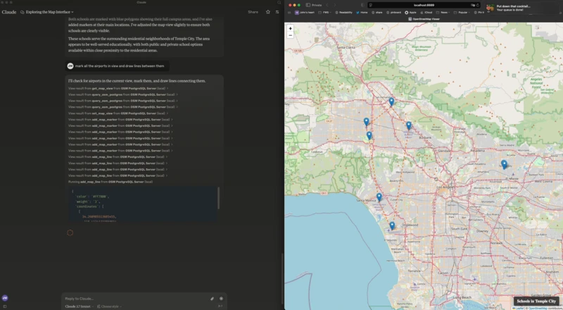

# MCP-OSM: OpenStreetMap Integration for MCP

This package provides OpenStreetMap integration for MCP, allowing users to query
and visualize map data through an MCP interface.

[](osm-mcp.webp)

## Features

- Web-based map viewer using Leaflet and OpenStreetMap
- Server-to-client communication via Server-Sent Events (SSE)
- MCP tools for map control (adding markers, polygons, setting view, getting view)
- PostgreSQL/PostGIS query interface for OpenStreetMap data

## Installation

This is my `claude_desktop_config.json`:
```json
{
  "mcpServers": {
    "OSM PostgreSQL Server": {
      "command": "/Users/wiseman/.local/bin/uv",
      "args": [
        "run",
        "--env-file",
        ".env",
        "--with",
        "mcp[cli]",
        "--with",
        "psycopg2",
        "--with-editable",
        "/Users/wiseman/src/mcp-osm",
        "--directory",
        "/Users/wiseman/src/mcp-osm",
        "mcp",
        "run",
        "mcp.py"
      ]
    }
  }
}
```

When the MCP server starts it also starts a web server at http://localhost:8889/
that has the map interface.

### Environment Variables

The following environment variables can be used to configure the MCP:

- `FLASK_HOST` - Host for the Flask server (default: 127.0.0.1)
- `FLASK_PORT` - Port for the Flask server (default: 8889)
- `PGHOST` - PostgreSQL host (default: localhost)
- `PGPORT` - PostgreSQL port (default: 5432)
- `PGDB` - PostgreSQL database name (default: osm)
- `PGUSER` - PostgreSQL username (default: postgres)
- `PGPASSWORD` - PostgreSQL password (default: postgres)

### MCP Tools

The following MCP tools are available:

- `get_map_view` - Get the current map view
- `set_map_view` - Set the map view to specific coordinates or bounds
- `set_map_title` - Set the title displayed at the bottom right of the map
- `add_map_marker` - Add a marker at specific coordinates
- `add_map_line` - Add a line defined by a set of coordinates
- `add_map_polygon` - Add a polygon defined by a set of coordinates
- `query_osm_postgres` - Execute a SQL query against the OpenStreetMap database
